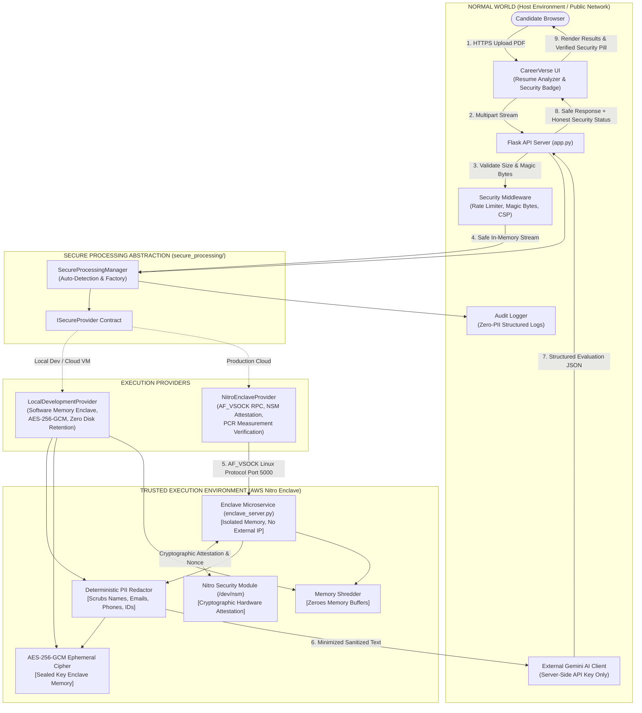

# 🚀 CareerVerse AI

[](https://www.python.org/)
[](https://flask.palletsprojects.com/)
[](https://ai.google.dev/)
[](https://careerverse-ai.onrender.com)
[](SECURITY.md)
[-brightgreen.svg)](tests/)
[](LICENSE)

> **Navigate Your Future with Universal AI Career Intelligence & Confidential Computing**  
> An all-in-one executive AI career intelligence platform offering personalized learning roadmaps, multi-currency salary benchmarks, purchasing power parity (PPP) adjustments, side-by-side career comparisons, privacy-first ATS resume scoring with in-memory PII minimization, and an interactive AI Career Mentor for **every real-world career field in the world**.

---

### 🌐 Live Web Application
🔗 **Live on Render**: [**https://careerverse-ai.onrender.com**](https://careerverse-ai.onrender.com)  
*(Hosted on Render Cloud with automated CI/CD continuous deployment directly from GitHub `main`)*

---

## 🌟 What's New in Version 3.0 (Security & Confidential Computing Edition)

- 🛡️ **Confidential Computing & Trusted Execution Environment (TEE) Layer**:
  - Implemented an isolated secure processing provider abstraction (`secure_processing/`) with zero unencrypted disk storage. Resumes are parsed as ephemeral in-memory byte streams (`io.BytesIO`) and wiped immediately after inference.
  - **Deterministic PII Minimization**: Scrubs candidate names, email addresses, phone numbers, Aadhaar/PAN/SSN, and postal codes in RAM before payloads reach external LLMs, while preserving all technical skills, degrees, and measurable achievements.
  - **Hardware TEE & Enclave Integration**: Fully architected for **AWS Nitro Enclaves** over Linux `AF_VSOCK` (Port 5000) with cryptographic attestation document fetching and PCR validation.
  - **Honest UI Claims**: Transparently displays `"Secure Processing: Development Mode (Software Enclave)"` in local/cloud VM environments and only claims hardware TEE when cryptographic hardware attestation is verified.
- 🔒 **OWASP Security Hardening & Rate Limiting**:
  - Sliding-window in-memory rate limiting on sensitive routes (15 req/min).
  - Magic-byte validation (`%PDF-`) and 10MB upload caps rejecting malformed or disguised files.
  - Comprehensive HTTP security headers (`Content-Security-Policy`, `X-Content-Type-Options: nosniff`, `X-Frame-Options: SAMEORIGIN`, `Referrer-Policy: strict-origin-when-cross-origin`).
  - Secret sanitization in error handlers and zero-PII structured audit logging.
- 💰 **Enhanced Salary & PPP Relocation Calculator**:
  - Real-time currency conversions alongside Purchasing Power Parity (PPP) adjustments.
  - 10-point diagnostic accuracy reporting including entry, mid, and senior pay bands, gross/net designations, and verified labor market registry citations.
- 🧪 **29-Test Automated Verification Suite**:
  - Comprehensive unit and integration test coverage across PII redaction, AES-256-GCM cryptography, provider abstractions, security middleware, and existing feature stability.

---

## ✨ Core Features & AI Modules

1. 🛣️ **AI Career Roadmap Generator & Executive PDF Exporter** (`/generate`)  
   Generates personalized multi-phase learning paths, required skill sets, practical hands-on tasks, verified resource links, and multi-page formatted PDF reports.

2. 📄 **Privacy-First ATS Resume Analyzer** (`/resume`)  
   Evaluates candidate resumes in memory against target roles with ATS keyword scoring, recruiter impact, skill evidence, and Google XYZ metrics—protected by the Confidential Computing PII minimization layer.

3. 💬 **Executive AI Career Mentor Workspace** (`/career-chat`)  
   Split-workspace interface with per-user isolated session memory, conversation history, prompt cards, and rich markdown rendering.

4. ⚖️ **Universal Career Compare Engine** (`/compare`)  
   Side-by-side comparison of earning potential, market demand scores, learning difficulty, growth velocity, and top hiring cities for any two roles globally.

5. 🪞 **Career Reality Check Engine** (`/career-reality`)  
   Unfiltered day-in-the-life realities, stress & burnout indices, work-life balance scores, and warning criteria for target roles.

6. 📊 **Career Intelligence Analytics Dashboard** (`/career-intelligence`)  
   Visualizes 6 dynamic Chart.js analytics graphs (Market Demand, Earning Tiers, Skill Heatmaps, Automation Risk, and 5-Year Growth Outlooks).

7. 🎯 **Career Match & Skill Gap Engine** (`/career-match` & `/skill-gap`)  
   Matches student profiles to optimal career roles and pinpoints missing tools, frameworks, and technologies.

8. 💰 **Salary Predictor & Diagnostic Engine** (`/salary-predictor`)  
   Predicts localized compensation with 10 diagnostic metrics across fresher, mid-level, and senior tiers.

9. 🌍 **Global Cost of Living & PPP Salary Adjuster** (`/col-calculator`)  
   Calculates realistic international relocation salaries using purchasing power parity factors across 195+ countries.

---

## 🏗️ Technical Architecture



---

## 🖥️ Tech Stack

| Layer | Technologies |
| :--- | :--- |
| **Frontend** | HTML5, Vanilla CSS3 (Dark Glassmorphism Theme), JavaScript (ES6+), Chart.js, FontAwesome 6.6.0 |
| **Backend Framework** | Python 3.11+, Flask, Gunicorn |
| **Security & Cryptography** | `cryptography` (AES-256-GCM, HKDF-SHA256), `secure_processing` module, OWASP headers, Sliding-Window Rate Limiting |
| **Confidential Computing** | AWS Nitro Enclaves specification, Linux `AF_VSOCK` RPC protocol, Nitro Security Module (NSM) Attestation |
| **AI Infrastructure** | Google Gemini API (`google-genai` / `google-generativeai`) with multi-model fallback |
| **Document Processing** | `pdfplumber`, `pypdf`, in-memory `io.BytesIO` streams |
| **Deployment** | Render Web Services, Docker / AWS Nitro Enclave Image File (`EIF`) |

---

## 📁 Repository Structure

```text
CareerVerse-AI/
├── secure_processing/               # Confidential Computing & TEE Security Layer
│   ├── __init__.py                 # Public package exports
│   ├── interface.py                # ISecureProvider abstract base class
│   ├── crypto.py                   # AES-256-GCM cipher & memory shredding
│   ├── pii_redactor.py             # Deterministic PII minimization engine
│   ├── local_provider.py           # Software memory enclave (Development)
│   ├── tee_provider.py             # AWS Nitro Enclaves AF_VSOCK provider
│   ├── manager.py                  # Factory & singleton lifecycle manager
│   ├── audit_logger.py             # Zero-PII structured security audit logger
│   ├── middleware.py               # Rate limiting, magic bytes, CSP headers
│   └── enclave_app/                # Production AWS Nitro Enclave microservice
│       ├── enclave_server.py       # AF_VSOCK enclave server & NSM attestation
│       ├── enclave.Dockerfile      # Amazon Linux minimal EIF container
│       ├── requirements_enclave.txt
│       └── run_enclave.sh          # Build & run script with PCR measurements
├── tests/                          # Comprehensive Automated Test Suite (29 tests)
│   ├── test_pii_redactor.py        # PII detection & competency preservation
│   ├── test_crypto.py              # AES-256-GCM, tamper detection, KDF
│   ├── test_secure_processing.py   # Provider abstraction & honest reporting
│   ├── test_security_api.py        # Security headers, rate limiting, error sanitization
│   └── test_existing_functionality.py # Zero-regression checks for existing features
├── static/
│   ├── css/                        # Responsive stylesheets & SaaS themes
│   ├── js/                         # Frontend client scripts & security indicators
│   └── data/                       # Country currency & economic datasets
├── templates/                      # Jinja2 HTML templates
│   ├── resume_analyzer.html        # ATS evaluator with security transparency modal
│   ├── generate.html               # Roadmap generator
│   ├── salary_predictor.html       # Salary diagnostic engine
│   └── ...                         # Additional views
├── app.py                          # Main Flask server & API route controllers
├── salary_data_layer.py            # Verified labor market salary dataset
├── SECURITY.md                     # Comprehensive security policy & threat model
├── docs/
│   └── TEE_ARCHITECTURE.md         # Detailed TEE engineering documentation
├── requirements.txt                # Production dependencies
├── Procfile                        # Render / Heroku process configuration
└── runtime.txt                     # Python 3.11.9 runtime declaration
```

---

## ⚡ Quick Start Guide

### 1. Prerequisites
- **Python 3.11+**
- **Git**

### 2. Clone Repository
```bash
git clone https://github.com/shubhodbirajdar928-hash/CareerVerse-AI.git
cd CareerVerse-AI
```

### 3. Set Up Virtual Environment
```bash
# Windows
python -m venv venv
.\venv\Scripts\Activate.ps1

# Linux / macOS
python3 -m venv venv
source venv/bin/activate
```

### 4. Install Dependencies
```bash
pip install -r requirements.txt
```

### 5. Configure Environment Variables
Create a `.env` file in the root directory:
```env
GEMINI_API_KEY=your_google_gemini_api_key_here
SECRET_KEY=careerverse_secure_session_secret_key_2026
SECURITY_MODE=auto
```

### 6. Run Application Locally
```bash
python app.py
```
Open **`http://127.0.0.1:5000`** in your browser.

---

## 🧪 Running the Test Suite

Execute all 29 automated security and regression tests:
```bash
python -m unittest discover -s tests -p "test_*.py" -v
```

Run PPP salary calculation tests:
```bash
python scratch/verify_ppp_logic.py
```

---

## ☁️ Deployment on Render

1. Connect your GitHub repository (`shubhodbirajdar928-hash/CareerVerse-AI`) to [Render](https://render.com).
2. Configure your Web Service:
   - **Environment**: `Python 3`
   - **Build Command**: `pip install -r requirements.txt`
   - **Start Command**: `gunicorn app:app`
3. Add Environment Variables:
   - `GEMINI_API_KEY`: `your_gemini_api_key`
   - `SECRET_KEY`: `your_randomized_session_secret`
   - `SECURITY_MODE`: `auto`
4. Access your live platform at: **`https://careerverse-ai.onrender.com`**

---

## 📜 Documentation Links

- 🛡️ [**SECURITY.md**](SECURITY.md): Full security specifications, STRIDE threat model, and data protection rules.
- 📐 [**TEE Architecture Document**](docs/TEE_ARCHITECTURE.md): Deep-dive into AWS Nitro Enclaves, vsock communication, and NSM hardware attestation.

---

## 👨‍💻 Author

**Shubhod Birajdar**  
*AI & Machine Learning Software Engineer*  
- **GitHub**: [@shubhodbirajdar928-hash](https://github.com/shubhodbirajdar928-hash)  
- **LinkedIn**: [shubhod-birajdar-90b5a832a](https://www.linkedin.com/in/shubhod-birajdar-90b5a832a)

---

## 📜 License

This project is licensed under the **MIT License** — see the [LICENSE](LICENSE) file for details.