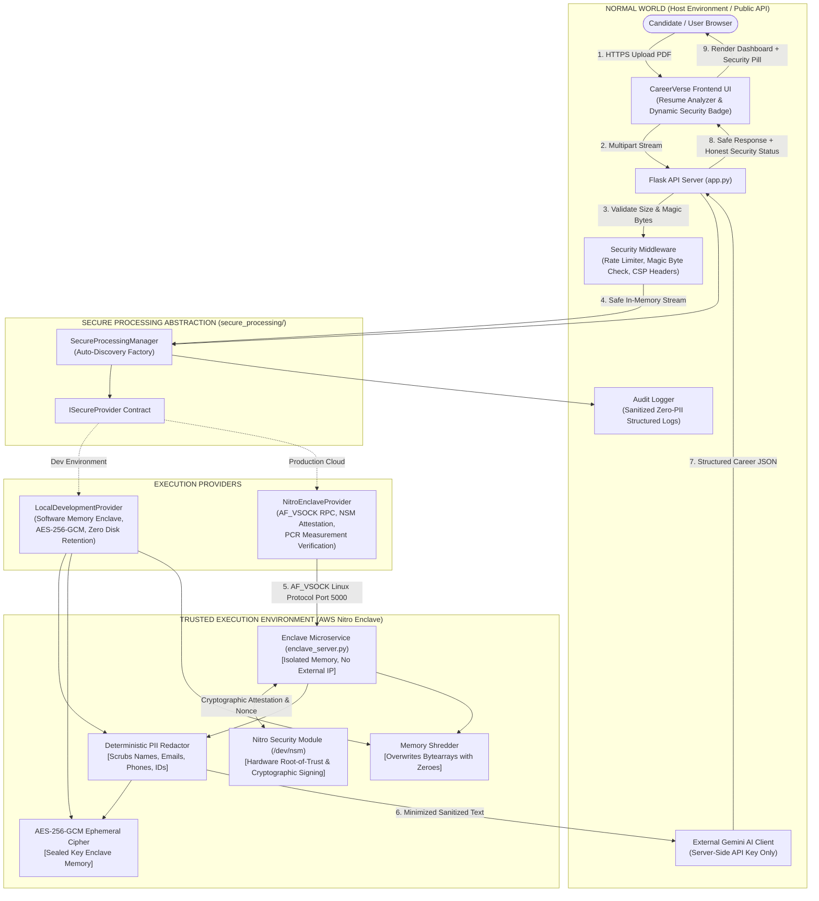

# CareerVerse AI - Trusted Execution Environment (TEE) Architecture

This document details the engineering architecture of the Confidential Computing layer in CareerVerse AI, outlining the boundary between the Normal World (Host Application) and the Secure World (Trusted Execution Environment).

---

## 1. System Architecture Diagram



---

## 2. Component Breakdown

### A. The Normal World
The Normal World consists of all non-sensitive services accessible to users and external networks:
- **Flask Web Server (`app.py`)**: Renders HTML/CSS/JS views, coordinates routing, handles cost-of-living calculators, salary benchmarks, and AI chat.
- **Security Middleware (`secure_processing/middleware.py`)**: Enforces OWASP security headers (`Content-Security-Policy`, `X-Frame-Options`, `X-Content-Type-Options`), restricts file uploads to 10MB, verifies `%PDF-` magic header signatures, and throttles requests via an in-memory sliding-window rate limiter.
- **Audit Logger (`secure_processing/audit_logger.py`)**: Records security events using anonymized client hashes while scrubbing any potential API keys or tokens.

### B. The Secure Abstraction Layer
The application never directly couples itself to a specific cloud vendor's enclave SDK. Instead, it relies on the `ISecureProvider` interface:
- **`process_sensitive_data(data, options)`**: Handles PII identification, redaction, and minimization.
- **`secure_inference(prompt, inference_fn, options)`**: Dispatches sanitized prompts to the AI provider.
- **`secure_key_operation(operation, data, key_id)`**: Executes symmetric authenticated encryption/decryption.
- **`get_attestation_report(nonce)`**: Returns the hardware or simulated attestation document.
- **`get_security_status()`**: Returns honest security parameters for user-facing UI indicators.

### C. The Trusted Execution Environment (Secure World)
In production, sensitive execution occurs inside an **AWS Nitro Enclave**:
- **Hardware Isolation**: The enclave has no persistent storage, no interactive login (no SSH), and no external network card. Communication with the parent host instance occurs exclusively over a private virtual socket (`AF_VSOCK`, port 5000).
- **Hypervisor Memory Encryption**: Memory allocated to the enclave is encrypted at the hardware level by the Nitro hypervisor.
- **Nitro Security Module (NSM)**: Provides cryptographic attestation documents signed by the AWS Nitro Root Certificate Authority.
- **Measurement Registers (PCRs)**:
  - **PCR0**: Cryptographic hash of the Enclave Image File (`EIF`).
  - **PCR1**: Cryptographic hash of the Enclave OS kernel and bootstrap.
  - **PCR2**: Cryptographic hash of the application code (`enclave_server.py`).

---

## 3. The Enclave Communication Protocol (VSOCK RPC)

The host and enclave exchange JSON-RPC packets over `AF_VSOCK`:

```
Parent EC2 Host (CID 3)                         Nitro Enclave (CID 16, Port 5000)
       │                                                       │
       │ ── 1. CONNECT(AF_VSOCK, CID=16, Port=5000) ─────────►│
       │                                                       │
       │ ── 2. {"command": "PING"} ──────────────────────────►│
       │ ◄─ 3. {"status": "PONG", "nsm": true} ────────────────│
       │                                                       │
       │ ── 4. {"command": "GET_ATTESTATION", "nonce": ...} ─►│
       │ ◄─ 5. {"status": "HARDWARE_ATTESTED", "pcrs": ...} ──│
       │                                                       │
       │ ── 6. {"command": "PROCESS_SENSITIVE_DATA", ...} ───►│
       │       (Raw resume text passed over isolated vsock)    │
       │                                                       │ [Enclave scrubs PII in RAM]
       │                                                       │ [Enclave shreds raw buffer]
       │                                                       │
       │ ◄─ 7. {"status": "SUCCESS", "processed_text": ...} ──│
       │       (Sanitized text returned to host)               │
       │                                                       │
       │ ── 8. CLOSE CONNECTION ──────────────────────────────►│
```

---

## 4. Verification & Attestation Flow

1. The client or auditor issues an attestation request to `/api/security-attestation?nonce=abc123xyz`.
2. `tee_provider.py` queries the enclave's NSM device.
3. The NSM device generates an attestation payload containing:
   - The user-supplied nonce (preventing replay attacks).
   - The PCR0, PCR1, and PCR2 hashes.
   - The public key of the enclave.
   - A digital signature generated by the AWS Nitro private key.
4. The client can verify this signature against AWS's publicly published Nitro Root CA certificate.
5. In development environments where Nitro hardware is not present, `local_provider.py` returns an honest diagnostic report explicitly indicating `is_hardware_backed: false` with all-zero PCRs.

---

## 5. UI Transparency Policy

The frontend UI dynamically reflects the active security state:

- **Local Development Mode**:
  - Badge: `Secure Processing: Development Mode`
  - Color: `#38bdf8` (Sky Blue)
  - Explanation: In-memory stream, zero disk retention, and PII redaction active. Non-hardware simulation.
- **Production Hardware TEE Active**:
  - Badge: `Confidential Computing: Hardware TEE Active`
  - Color: `#22c55e` (Emerald Green)
  - Explanation: Hardware-isolated AWS Nitro Enclave active with hypervisor memory encryption and verified NSM attestation.
